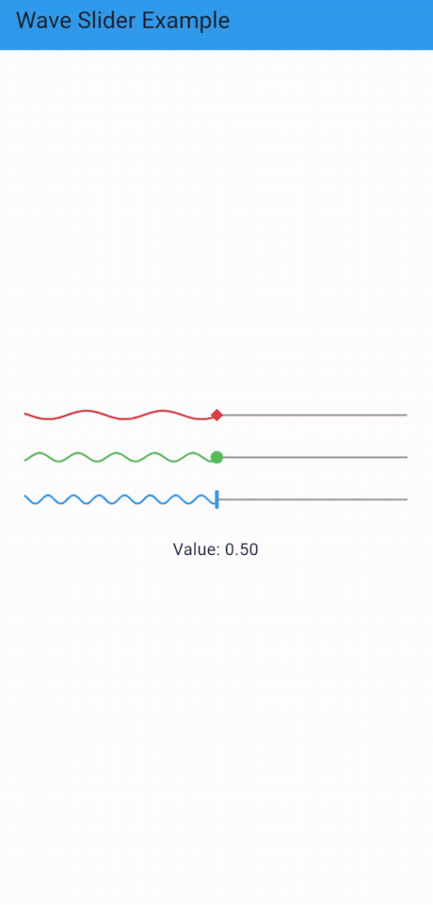

# Wave Slider Flutter 🌊

An animated and customizable wave-style slider for Flutter.

`wave_slider_flutter` provides a smooth sine-wave slider with configurable
animation behavior and multiple thumb styles.

---

## ✨ Features

- Animated sine-wave slider track
- Configurable wave amplitude & frequency
- Multiple thumb shapes (circle, bar, diamond, star)
- Optional flatline behavior while dragging
- Lightweight and dependency-free

---

## 📦 Installation

Add this to your `pubspec.yaml`:

```yaml
dependencies:
  wave_slider_flutter: ^0.1.0
````

---

## 📸 Screenshots


## 🚀 Usage

```dart
double value = 0.5;
WaveSlider(
  value: value,
  onChanged: (v) {setState(() => value = v);}
);
```


## 🎨 Customization

```dart
WaveSlider(
  value: value,
  onChanged: (v) => setState(() => value = v),
  theme: WaveSliderTheme(
    activeColor: Colors.blue,
    inactiveColor: Colors.grey,
    amplitude: 4,
    frequency: 10,
    thumbShape: WaveSliderThumbShape.bar,
  ),
);
```


